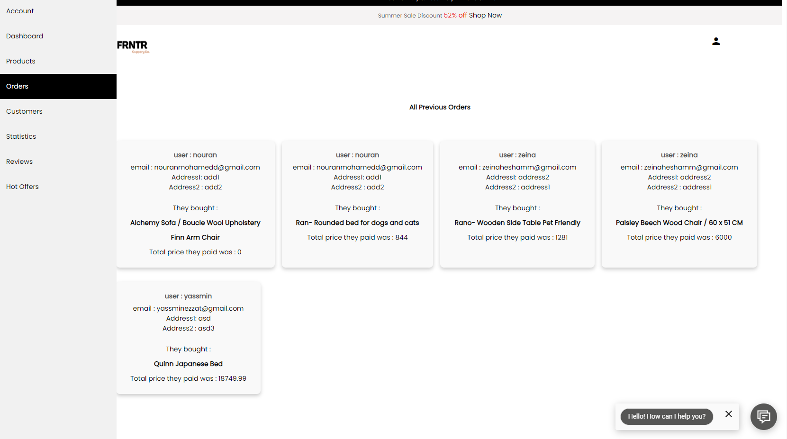
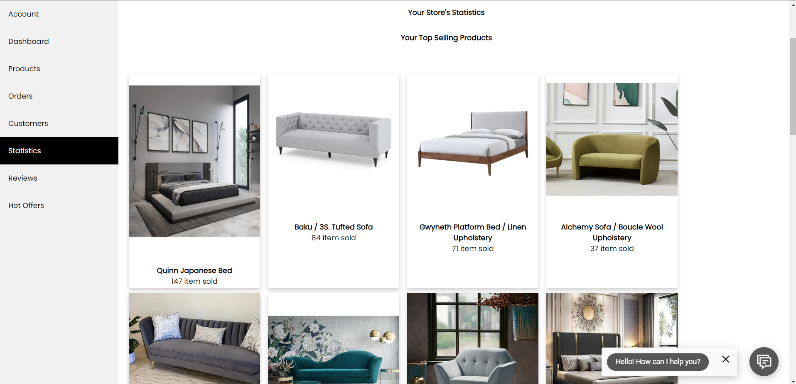

# FRNTR - Premium Furniture E-commerce Store

Welcome to FRNTR, the premium destination for high-quality furniture at affordable prices. Our website is currently static, but we have implemented several front-end features to enhance your shopping experience. Here are some of the unique aspects that make FRNTR stand out:

## User Pages

### Navigation Partial:
Partial Description: Includes a search bar to easily find items and a robust navigation bar for seamless browsing.

- **Unique Feature**: The cart and wishlist only appear when a user is logged in. The login process includes a sidebar that enhances the aesthetic appeal. Additionally, the signup process sends an email verification to ensure authentication. The forgot password functionality also requires email verification for secure password recovery.

### Footer Partial:
Partial Description: Includes the contact information and a fully functional newsletter subscription area integrated with the MailChimp API.

- **Unique Feature**: The newsletter subscription is seamlessly integrated with the MailChimp API for efficient communication with customers.

### Home Page:
Page Description: The page is fully responsive and designed with a professional theme.

- **Unique Aspects**: Includes an automated slideshow and a responsive UI. Also features a chatbot powered by Dialogflow for enhanced customer support.

### Products Page:
Page Description: The page is fully responsive and includes sorting and filtering options.

- **Unique Aspects**: The sort, search, and filter options are seamlessly integrated to help users find their perfect item. Users can add items to the cart and wishlist directly from this page if they are logged in. Additionally, the page showcases hover animations on all products, providing different angles for each item.

### Item Page:
Page Description: The page is fully responsive and provides smooth transitions between item pictures. It also displays similar items from the backend.

- **Unique Aspects**: Users can add items to the cart and wishlist only if they are logged in. Additionally, users can submit reviews for products, but the reviews need to be manually accepted by admins before appearing. The page also features hover animations on all products, displaying different angles for each item.

### Account Page:
Page Description: Allows users to edit their details and addresses, with easy navigation to access the wishlist and cart.

- **Unique Aspects**: The account page provides a user-friendly interface for users to manage their personal information and easily access their wishlist and cart.

## Admin Pages (Accessible only to admins)

### Dashboard:
Page Description: The page is responsive and displays details on total orders, total users, and total products. It also includes statistics on the top 5 most sold items.

- **Unique Aspects**: The dashboard showcases hover animations on all products, displaying different angles for each item.

### Products Page:
Page Description: Allows admins to browse through paginated products, search for products by name, and add or delete individual products.

- **Unique Aspects**: The page supports pagination and enables admins to search for products using their names. The search and sort queries can be combined to easily find specific products.

### Add Product:
Page Description: The page uses the same EJS file as the edit product page, with conditions to display the appropriate form.

- **Unique Aspects**: The page utilizes the Dropzone JavaScript library to simplify the process of adding and removing images dynamically. This improves the functionality compared to the standard file input method, which does not allow deletion of individual images.

### Edit Product:
Page Description: The page uses the same EJS file as the add product page, with conditions to display the appropriate form.

- **Unique Aspects**: The page utilizes the Dropzone JavaScript library to simplify the process of adding and removing images dynamically. This improves the functionality compared to the standard file input method.
link: https://frntr.store/adminproduct/addeditproduct

### Orders Page:
Page Description: Displays all previous orders and the number of times each product has been sold.

- **Unique Aspects**: The page showcases hover animations on all products, displaying different angles for each item.

link: https://frntr.store/admin/orders

### Customers Page:
Page Description: Displays a list of all users with the ability to edit and delete user information.

- **Unique Aspects**: The page supports pagination, allowing admins to easily navigate through a large number of users. Admins can search for users by email addresses and change the role of users to either admin or client with a simple click.

link: https://frntr.store/admin/customers

### Statistics Page:
Page Description: Displays a list of the top 10 best-selling items and top 10 worst-selling items to provide admins with insights on trending products.

- **Unique Aspects**: The page showcases hover animations on all products, displaying different angles for each item.

link: https://frntr.store/admin/statistics

### Reviews Page:
Page Description: Displays customer reviews for each item, allowing admins to moderate and manage reviews.

link: https://frntr.store/admin/reviews

### Hot Offers:
Page Description: Displays all items with special offers in the database.

- **Unique Aspects**: The page showcases hover animations on all products, displaying different angles for each item.

link: https://frntr.store/admin/offer

## Check Out Our Web Application

Experience the convenience of online furniture shopping through our web application. Click on the following link to check it out:

[frntr.store](https://frntr.store)

## Repository Transfer

Please note that we have transferred from our old repository at [https://github.com/GeorgeAyy/Web-Ninjas-El-Cyber](https://github.com/GeorgeAyy/Web-Ninjas-El-Cyber) to this new repository.

## Contact Us

Need help or have a question? Feel free to reach out to us!

Thank you for choosing FRNTR for your furniture needs. We are committed to delivering premium products and exceptional customer service.
